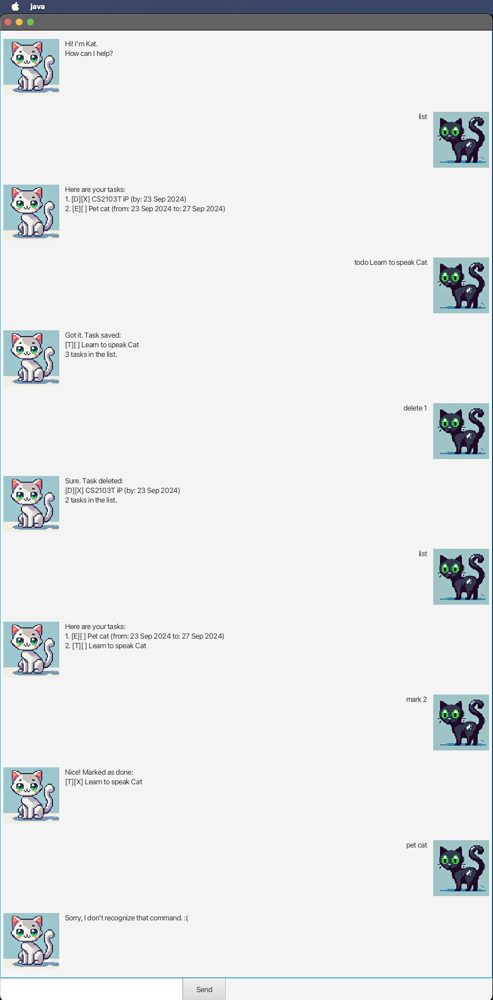

# Kat User Guide



Kat helps you to easily track and manage your daily tasks. 

## Features

### Adding Todos

Adds a Todo task to the list.

* **Format**: `todo <description>`
* **Example(s)**:
  * `todo Learn to speak Cat`
* **Output**:
    ```
    Got it. Task saved:
    [T][ ] Learn to speak Cat
    1 tasks in the list.
    ```

### Adding Deadlines

Adds a Deadline task to the list.

* **Format**: `deadline <description> /by <deadline>`
* **Example(s)**:
  * `deadline Complete project /by 2024-09-23`
* **Output**:
    ```
    Got it. Task saved:
    [D][ ] Complete project (by: 23 Sep 2024)
    2 tasks in the list.
    ```

### Adding Events

Adds an Event task to the list.

* **Format**: `event <description> /from <start time> /to <end time>`
* **Example(s)**:
  * `event Hackathon /from 2024-09-23 /to 2024-09-24`
* **Output**:
    ```
    Got it. Task saved:
    [E][ ] Hackathon (from: 23 Sep 2024 to: 24 Sep 2024)
    3 tasks in the list.
    ```

### Listing Tasks

Displays all tasks in the list.

* **Format**: `list`
* **Example(s)**:
  * `list`
* **Output**:
    ```
    Here are your tasks:
    1. [T][ ] Learn to speak Cat
    2. [D][ ] Complete project (by: 23 Sep 2024)
    3. [E][ ] Hackathon (from: 23 Sep 2024 to: 24 Sep 2024)
    ```

### Marking Tasks as Done

Marks a task as completed.

* **Format**: `mark <task number>`
* **Example(s)**:
  * `mark 1`
* **Output**:
    ```
    Nice! Marked as done:
    [T][X] Learn to speak Cat
    ```

### Unmarking Tasks

Marks a completed task as not done.

* **Format**: `unmark <task number>`
* **Example(s)**:
  * `unmark 1`
* **Output**:
    ```
    Ah! Unmarked as not done:
    [T][ ] Learn to speak Cat
    ```

### Deleting Tasks

Removes a task from the list.

* **Format**: `delete <task number>`
* **Example(s)**:
  * `delete 2`
* **Output**:
    ```
    Sure. Task deleted:
    [D][ ] Complete project (by: 23 Sep 2024)
    2 tasks in the list.
    ```

### Finding Tasks

Searches for tasks containing specific keywords.

* **Format**: `find <keyword>`
* **Example(s)**:
  * `find speak`
* **Output**:
    ```
    Here are the matching tasks:
    1. [T][ ] Learn to speak Cat
    ```
